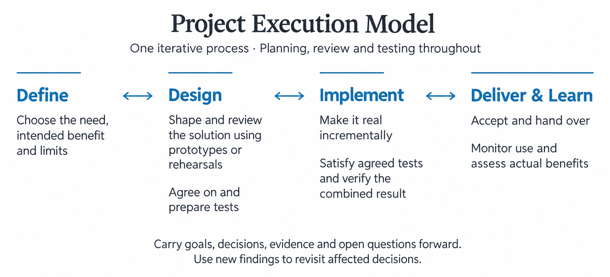

# Project Execution Model

*Version 1.0 — Initial release | 22 September 2026*

Author: **Leon.id Komarovsky** — [leonid@komarovsky.info](mailto:leonid@komarovsky.info)

## Goal

A project can deliver exactly what was agreed and still fail to solve the problem that started it. As plans, discussions, and results accumulate, the reason for a decision can become hard to find. When work changes hands, the next contributor may receive the result without knowing what has been checked or what remains uncertain.

The Project Execution Model guides a project from an initial idea through delivery, acceptance, and learning from real use. Throughout the project, carry forward the relevant goal, decisions, evidence, and open questions so the next human or AI contributor can build on what is known and challenge what no longer holds. It applies across domains, from one-person projects to large organizations.

## The Project Journey

Four recurring areas of work give the project direction:

| Area | Guiding Question |
| --- | --- |
| **[Define](#define)** | What should we pursue, and why is it worth the commitment? |
| **[Design](#design)** | How should the result work? |
| **[Implement](#implement)** | How do we make the agreed result work in reality? |
| **[Deliver & Learn](#deliver--learn)** | Can people use and accept it, and does it produce the intended benefit? |

These areas form **one iterative process**. Work moves between them as findings require: a review can change the design, a test can challenge an assumption, and actual use can reopen the original need. Revisit only affected work and retain what still holds. One contribution may already be in use while another is being designed. At any point, the decision may be to continue, investigate, revise, pause, or stop.

Use the journey to see the model in practice. [Main Concepts](#main-concepts) brings together the rules that apply throughout.

**Review and testing run throughout.** Tests are checks against expectations, including manual assessments. They develop across all four areas as expectations emerge. Mocks—stand-ins or rehearsals—help people explore and review proposed behavior.

Work in **increments**: manageable pieces with a result you can check. Before implementing each increment, agree on its checks and prepare them. These form the **implementation contract**, the shared agreement about what that piece must demonstrate. Implementation satisfies it and checks how its parts are built and work together.

Progress brings greater commitments. Before a major purchase, live trial, wider rollout, or other consequential action, [check readiness](#check-readiness-before-committing) for that particular commitment. A milestone can record that decision and its scope; later findings may require it to be revisited.

**Plan throughout the project**, including mock creation and reviews, and revise plans when findings change the approach. Keep the project's scope, assumptions, decisions, and evidence current. Manage its dependencies, resources, budget, risks, and communication. Address relevant safety, privacy, security, accessibility, and other obligations.

The whole project need not be specified upfront, and the areas and practices do not require separate documents.

The example running through these areas follows a café. At lunchtime, customers who phoned ahead still queue for ten minutes to collect their food. Some give up and leave.

### Define

> *What should we pursue, and why is it worth the commitment?*

Establish the need, who should benefit, the scope, and who is responsible. Agree on the completion boundary: what the project must accomplish before it can close. Keep three claims separate, with a way to assess each:

- **Delivery acceptance:** what would make the delivered result acceptable.
- **Outcome success:** what benefit it should produce.
- **Execution constraints:** the time, money, resources, and other limits the project must respect.

Start preparing tests alongside these expectations. Refine them as the project learns more; a mock review is not a prerequisite for every test.

Investigate the current situation and baseline, challenge key assumptions, and check major feasibility and resource constraints. Compare credible approaches, including reuse, purchase, process change, or doing nothing.

Explain why the expected benefit warrants the chosen approach's time, money, risk, and ongoing obligations compared with those alternatives. Use enough evidence to justify the next substantial commitment, and revisit the rationale if findings materially change value, cost, or feasibility. A business plan can support this reasoning as a separate, optional project artifact.

Identify who can authorize commitments, accept delivery, approve permitted exceptions, and close the project, including the limits of that authority.

> **At the café:** The owner compares another cashier with a separate pickup point. Observations show that ready orders sit waiting while the cashier takes new orders, so the owner chooses to try the cheaper pickup point first. Delivery means handing over the correct food safely. The change must fit the existing staffing budget.
>
> The owner prepares the benefit test now: **at least nine in ten customers arriving to collect food must receive it within five minutes**. During the first week of regular use, record every collection attempt: the arrival time and either the handover time or that the customer left without their food. Leaving without food counts as missing the target. The owner will review the result at the end of that week. This test exists before any mock, although the evidence cannot yet be collected.
>
> The owner also agrees on the completion boundary: the setup must pass its required checks, be accepted, and be handed over. The later benefit review remains the owner's responsibility.

### Design

> *How should the result work?*

Describe the requirements and intended experience alongside the structure that makes them possible. Show how people and parts fit together: what each does, what information or work they exchange, what they depend on, and how failures are handled. This makes the project's architecture explicit. Refine the experience and structure together, within feasibility and resource limits. Plan how the result will be delivered, adopted, supported, and recovered if it fails, where relevant.

#### Review the Proposal With Mocks

A mock is a stand-in used to explore how something would work. It might be a prototype, sample, or rehearsal. It can also represent an interaction. A fake API stands in for how software systems exchange requests and responses, simulating success, failure, and state changes. A rehearsal can represent a handoff between people.

Mocks give people something concrete to try and question. They help expose misunderstandings and missing behavior before investing in the real result, while design changes are still inexpensive.

Prefer inexpensive mocks that answer the relevant questions. Use the smallest useful new or existing mock, or reuse still-applicable review evidence that already answers the question. More mocks are useful only when they resolve additional relevant uncertainty. Plan each mock's creation and review around clear questions, conditions, and participants. Include draft usage guidance where it helps.

When a new review is needed, have appropriate people try the mock manually, involving intended users, affected parties, or relevant expertise where needed. Look for problems with usefulness, clarity, feasibility, and missing behavior. Refine the mock or return to the decisions the findings challenge.

For each meaningful mock, briefly identify **what it represents, what people observed under the tested conditions, and what remains unproven**. Carry those open claims into later checks. For example, a user interface with a fake API can show how the interface handles a simulated timeout; it cannot show that the real service recovers correctly.

If no mock can credibly answer a material question, use reviewed findings from a [bounded real experiment](#check-readiness-before-committing). Keep mocks for questions they can answer.

Review findings develop the design and its tests together. If preparing a check exposes a problem with the mock or design, revise the affected work before relying on it. Carry forward the reviewed proposal, the reasons for its choices, the evidence, and the remaining uncertainty.

> **At the café:** The team sketches a pickup area with bags labeled by customer name. A staff member checks each collection and alerts the kitchen about missing orders. Staff and a few customers rehearse with empty bags, including two customers named Alex. The Alex orders get swapped. The team changes the design to use order numbers and rehearses again.
>
> People can now follow the handoff in those sample situations. This does **not** establish whether real food will be handled safely or collected quickly during a rush. The findings refine the design and add checks for real orders alongside the benefit test.

#### Agree on the Implementation Contract

**The implementation contract is the agreed set of tests a piece of work must satisfy to count as implemented.** This subset of project tests is the main agreement between Design and Implementation. It covers all agreed expectations assigned to that piece: what it must do, how people or parts exchange work or information, the required quality and limits, and how they work together. Select tests from those responsibilities, not from what is easiest to pass.

Tests can originate in any of the four areas; mock review informs and refines them. Use the agreed need and success criteria to judge the result. Keep the design and the reasons for it alongside the checks: passing an incomplete set does not settle a known problem. The tests can live in an existing checklist or other project record; no separate document or test framework is required.

**Prepare these checks before implementing the piece of work.** Agree on the conditions, what a pass looks like, the evidence needed, and which commitments depend on the result. Identify checks that need real people or parts working together. Assign responsibility and timing for checks that need delivery or actual use. If those later checks need measurements or records, include the ability to collect them in the implementation contract now.

> **At the café:** Before changing live service, the team agrees on the pickup-point implementation contract and prepares its checks:
>
> - **Correct order:** two customers with the same name each receive their own numbered order.
> - **Missing order:** staff notify the kitchen and give the customer an accurate update.
> - **Safe handling:** real orders meet the café's existing food-handling rules.
> - **Staffing budget:** recorded staff hours and costs stay within the agreed staffing budget.
> - **Time records:** every collection attempt has an arrival time and either a handover time or a record that the customer left without food. Recorded times are accurate to within ten seconds of an observer's record during the pilot.
>
> The plan starts with a small trial, then a full lunchtime pilot. The team agrees on the prerequisites for the trial and the evidence required before each expansion. All five checks must pass on the real combined setup under busy conditions before regular service is accepted. The separate week-long benefit test remains the owner's later obligation.

### Implement

> *How do we make the agreed result work in reality?*

The agreed tests turn expectations into a concrete target for implementation. Satisfying them provides evidence that the real result meets those expectations under the tested conditions; failures guide corrections or reveal a decision that needs revisiting.

**Start with the prepared tests.** Before adding new behavior, run its checks against the current real result where possible to establish what already works and confirm that the checks expose the intended missing behavior. Failures caused by missing implementation are expected at this point: they show what the implementation still needs to satisfy. Record them as [failures, not passes](#develop-tests-throughout). Retain valid passes for behavior that already exists. If a check has not yet run, record it as pending, with its assessment method ready. A pass against a mock supports only the behavior and conditions actually tested.

A costly or destructive check need not run merely to confirm known missing work. Prepare its assessment before implementation and agree when it must run. It stays pending until run; any pass required for the next commitment is still required.

**Implement, check, and adjust.** Create, acquire, arrange, configure, or change the real things required. Put reviewed parts and interactions into real operation incrementally, replacing mocked parts where present and moving rehearsed human work into live practice. Preserve the reviewed behavior and interfaces, or explicitly revise them when findings require it.

**Add internal verification where needed.** Check the implementation's own choices: individual parts, calculations, connections, failure handling, or operational procedures. Prepare these checks before the corresponding work when the need is known, and add or revise them as findings expose gaps. A check can serve both internal verification and the contract. "Internal" does not mean a lower standard or permission to ignore a failure.

Run relevant contract and internal checks as each mocked part is replaced or increment of real work is introduced. Use failures to guide changes, then rerun affected checks. Combine contributions and collect evidence. If a finding exposes a missing expectation or flawed approach, return it to the affected decision and explicitly agree on any change to the contract. Make deviations visible; do not weaken a check merely to obtain a pass.

**Verify the combined result before finishing.** Check the real parts working together against the agreed criteria in their intended setting where available. Identify the real parts and conditions each piece of evidence applies to. Successful individual parts, mocks, or partial replacements do not establish that the whole works. Check documentation, quality, and readiness for delivery, adoption, support, and recovery where relevant. Reuse valid evidence already collected during implementation.

**An implementation increment is complete when its real result, including the relevant combined behavior, satisfies its agreed completion checks.** Any permitted exception remains explicit under the [commitment rules](#check-readiness-before-committing). Keep missing evidence visible. Completion does not establish results for checks assigned to later delivery or actual use; carry those obligations forward with responsibility and timing.

> **At the café:** The team first runs the checks it can against the existing service and retains applicable evidence. Checks that cannot yet run stay pending. Once ready for the limited trial, it installs the pickup point and starts with a few real orders. The correct-order check fails when a number folds underneath a bag.
>
> Staff add an internal check: numbers must remain readable when bags are stacked and carried. It fails with the current labels. They change the label position, then rerun this check and the affected contract checks. Once the small-trial requirements pass, the team can expand.
>
> The full lunchtime pilot checks the real kitchen, staff, pickup area, and customers together. Correct-order, missing-order, safe-handling, staffing-budget, and time-record checks all pass under busy conditions. This fulfils the increment's contract. It also establishes that the owner can collect the evidence for the week-long benefit test, whose outcome remains pending.

#### Live Services

**Implementation and delivery can overlap for a live service.** For a course, check the offer and booking arrangements before taking bookings, teaching and venue arrangements during the sessions, and learning outcomes afterward. Agree on the checks needed before each commitment; collect the remaining evidence at its assigned time.

**A project to launch or change a service has its own completion boundary.** It may include a pilot or first group of customers. Routine delivery uses established procedures and checks for each customer, without a fresh project cycle for every engagement. New findings can reopen the service's design or the original decision to offer it.

### Deliver & Learn

> *Can people use and accept it, and does it produce the intended benefit?*

**Accept delivery.** Deliver or activate the result, support adoption and intended use, and run checks requiring the real setting or actual use. Apply the agreed test requirements to delivery, acceptance, and closure. State separately which claims about delivery acceptance, outcome success, and execution constraints have evidence, and which remain unproven. Add or refine checks when delivery or actual use reveals new conditions or gaps.

**Follow through on the benefit.** When the benefit needs actual use to assess, assign an owner and a time or condition for the check. That owner compares the evidence with the intended benefit and makes or obtains an authorized decision to continue, improve, reconsider the approach, or stop. Acceptance alone does not prove that the benefit occurred.

**Hand over and close.** Confirm acceptance and handover, settle required obligations, assign ongoing responsibilities, clean up temporary resources, and record lessons. If the project stops early, apply the relevant closure responsibilities even when nothing is delivered.

For every permitted pending check, identify when it will run, who will act on its findings, and what decision it will inform. If it depends on conditions that may not occur, set a review date. Close according to the agreed completion boundary, with later testing and outcome-review responsibilities explicitly accepted by the receiving owner. Pending checks and exceptions remain distinct from passes after acceptance and closure.

**After the Project Closes.** While the result remains in use, the receiving owner is responsible for relevant testing and monitoring of how it works and whether it delivers the intended benefit. At handover, agree on the checks, responsibility, and timing or triggers, proportionate to risk and change. Use findings to guide maintenance, improvement, or reconsideration of the original need or approach. Routine work follows established procedures; substantial improvements use this model at a useful scale, carrying forward applicable goals, decisions, evidence, and open questions.

> **At the café:** The owner accepts the setup for regular service after the required checks pass. The setup project can close once its handover obligations are settled; the owner accepts responsibility for the one-week review and the decision that follows.
>
> After a week, only seven in ten customers arriving to collect food receive it within five minutes. **Delivery was accepted; the intended benefit was not achieved.** The owner authorizes improvement work, returning to Design with the collection records to locate the remaining delay. Checks and evidence that still apply are retained.

## Main Concepts

These principles bring together the rules used throughout the journey, with more detail on evidence, commitments, and scale. They apply whether the project changes software, a service, a physical product, or a way of working.

### Advance With Evidence

As work moves between areas and contributors, carry forward the relevant goal, decisions and their reasons, evidence, and open questions. Build on what still holds. When a review supports the approach and readiness checks are satisfied, continue. **Finding a material problem before a larger commitment is progress:** it lets you correct course while change is less costly.

Revisit affected decisions when findings challenge them, retain valid evidence, and repeat necessary checks. Actual use may challenge the original need or approach even after accepted delivery.

Correcting a test or adding coverage is different from changing the intended target. Agree on changes to expectations and the implementation contract with the responsible decision-maker, keeping the reasons and supporting evidence visible. Do not quietly redefine failure as success.

### Develop Tests Throughout

Develop tests across all four areas. **Prepare relevant checks before the work they will guide.** Agree on the checks assigned to an implementation increment as its [implementation contract](#agree-on-the-implementation-contract). Exploration can have its own questions and checks; run each check when the necessary evidence is available.

Cover all agreed expectations for behavior, quality, delivery acceptance, intended benefits (such as profit where relevant), and execution constraints. Include important assumptions, failure cases, and unintended effects.

For each check, specify the conditions, expected result, evidence, timing, and responsibility. Use measurable criteria where meaningful; otherwise specify observable criteria and an explicit assessment method. Prepare any measurement capability needed. Keep outcomes clear:

- **Passed:** valid, applicable evidence shows that the agreed criteria were met under the recorded conditions.
- **Failed:** the check ran and its criteria were not met. This includes a check that fails as expected because the real component has not yet been built; record why it failed.
- **Pending:** the check has not run or completed, so it has no outcome yet. This is distinct from a check that ran and failed. Neither status is a pass.

Record a decision and any follow-up for every known failure, even if the check does not block the next commitment. For expected failures caused by work not yet implemented, the existing implementation agreement can serve as the recorded decision and follow-up. Failures that challenge that agreement need a further decision. Record approved exceptions separately. The same evidence limits apply to contract tests, internal verification, and later project checks.

### Check Readiness Before Committing

Before **any costly or consequential commitment**, check that the evidence is sufficient and the approach, dependencies, resources, authorization, and other prerequisites are ready. You need enough evidence for that commitment, not certainty about the whole project. Do not implement work that depends on material decisions still being explored.

Begin an implementation increment only when its relevant decisions have been sufficiently reviewed, its test preparation is ready, and its other prerequisites are met. Agree which checks must pass for each commitment and which may remain pending. Distinguish checks needed to begin a limited live trial from those the trial will produce for later rollout or acceptance. A behavior test may fail before implementation and be required to pass before delivery.

**A required test without a valid, applicable pass blocks the commitment it governs**, unless an authorized decision-maker explicitly approves a permitted exception. An exception is permitted only within the project's agreed limits, applicable obligations, and the decision-maker's authority. Record the justification, the specific commitment permitted, remaining risk, and any conditions or follow-up. An exception permits a specified action; it does not change a test result or supply missing evidence.

When a mock cannot credibly answer a material question, use a bounded real experiment. Give it a clear question, assessment method, limits, required authorization, and stopping conditions. Review its findings and remaining uncertainty; carry both into design, test preparation, and the next commitment decision.

### Replace Mocks With Reality Progressively

For each useful increment, build on [reviewed mocks or still-applicable review evidence](#review-the-proposal-with-mocks). Use a [bounded real experiment](#check-readiness-before-committing) when mocks cannot credibly answer a material question.

As stand-ins become real parts and rehearsals become live practice, [verify each change and the relevant real combined result](#implement). Carry unresolved claims into later checks.

Mocks can remain in tests for controlled conditions such as timeouts. Their passes support only what was actually tested; they do not prove that the substituted component works or that the real parts work together.

### Apply the Model at a Useful Scale

Apply the same approach to substantial contributions with meaningful uncertainty or consequential commitments, including within implementation. Inherit the parent project's relevant goals, constraints, decisions, interfaces, and evidence, and agree on checks for the contribution's responsibilities.

If a finding challenges an inherited decision, raise it for review in the parent project. Provide the parent project with the contribution's real result and checks; the parent project still verifies the combined outcome. A minor, well-understood task needs no nested cycle.

Scale coordination and checks to risk, uncertainty, and complexity. Combine activities and records while covering relevant responsibilities. Reuse applicable evidence and existing records; a separate document, team, or ceremony is not required for each area.

> **A compact café record:** “Order numbers hidden after stacking: label check failed. Shift lead moved the labels and reran the label and correct-order checks; both passed in the small trial.” This one note records the finding, action, owner, and scoped result without a separate review document.

## Boundary

This model is self-contained guidance for project execution. General definitions and rules for work, roles, work-item structures, and the mechanics of operational planning belong to the separate Work Management Model.
